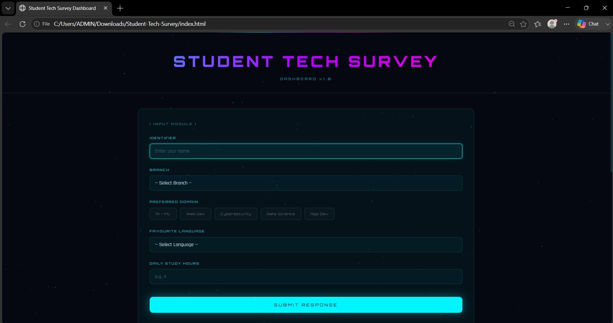
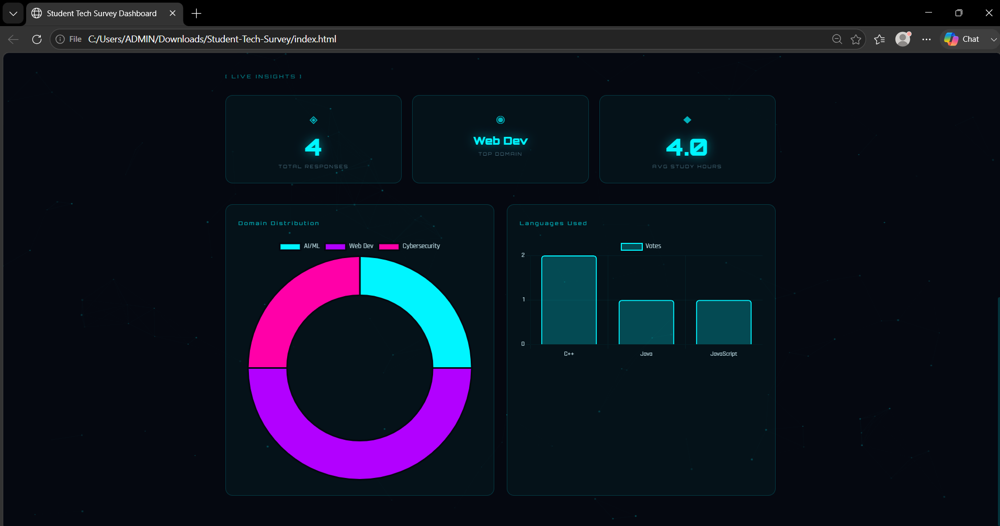

# Student Tech Survey Dashboard

A modern web-based dashboard that collects and visualizes students' technology interests and study habits.

This project was built using HTML, CSS, JavaScript, and Chart.js as part of my learning journey in Web Development and Data Analytics.

## Features

- Interactive student survey form
- Collection of technology preferences and study habits
- Live dashboard displaying:
  - Total Responses
  - Most Popular Domain
  - Average Study Hours
- Dynamic data visualization using Chart.js
- Modern futuristic UI with a dark theme
- Responsive and user-friendly design

## Survey Parameters

The dashboard collects information such as:

- Student Name
- Branch
- Preferred Technology Domain
- Favorite Programming Language
- Daily Study Hours

## Technologies Used

- HTML5
- CSS3
- JavaScript (ES6)
- Chart.js
- Google Fonts

## Dashboard Insights

The project analyzes survey responses and provides:

- Total number of participants
- Most popular technology domain
- Average study hours
- Domain distribution chart
- Programming language distribution chart

## Learning Objectives

This project was created to:

- Practice frontend web development
- Learn form handling using JavaScript
- Explore basic data collection and analysis concepts
- Understand data visualization techniques
- Build a project related to data-driven decision making

## Future Improvements

- Data persistence using Local Storage
- Advanced analytics and filtering
- User authentication
- Backend database integration
- Real-time survey updates

## Project Status

Version 1.0

## Author

Hrishika Mahale
Learning Web Development, Data Science, and AI/ML
Computer Engineering Student

Learning Web Development, Data Science, and AI/ML
